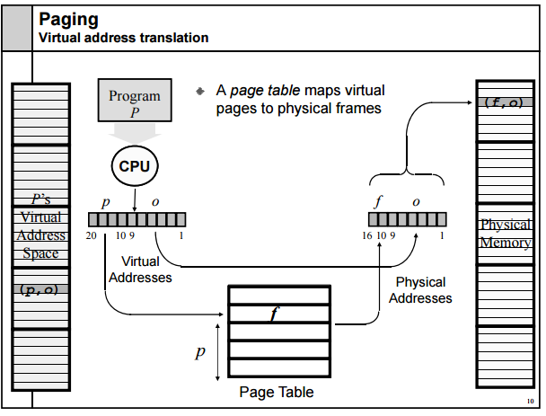

# 03 — Memory Layout

> Every running program has its own private memory space, organized into distinct regions. Understanding this layout is essential for RE, exploit development, and understanding crashes.

---

## Virtual Address Space

When a program runs, the OS gives it its own private **virtual address space** a range of addresses that *appear* to be its own dedicated memory. The OS + CPU translate these virtual addresses to physical RAM behind the scenes.

On a 64-bit system, each process gets an enormous virtual address space (theoretically 128TB), though only a fraction is actually used at any time.



The diagram shows how a program's virtual address is converted into a physical address in RAM. The process works as follows:

The CPU generates a virtual address, which is split into two parts: the page number (p) and the offset (o).The diagram shows p as 20 bits and o as 12 bits, which corresponds to a 4KB page size (since 2^12 = 4096).  

The page number p is used as an index to look up the Page Table.The page table acts as a map, returning the corresponding physical frame number (f) where that virtual page is stored in RAM.
The offset (o) is not translated.It remains the same and represents the byte's position within the page.  

The final Physical Address is created by combining the physical frame number f from the page table with the original offset o.  
This address is then used to access the actual data in Physical Memory.  

This is how the OS enforces isolation: because each process has its own page table, the threads of one process are mapped to a completely different set of physical pages than the threads of another process, even if they use the same virtual address (like 0x00400000).  

**Why 0x400000?**  

Avoids NULL Pointer Issues: The memory near address 0x0 is intentionally left unmapped to catch programming errors like null pointer dereferences, which cause an immediate crash (segmentation fault).   Starting at 0x400000 creates a safe 4 MB buffer zone below the program's code.  

Page Alignment: It is a multiple of the standard 4KB page size, which is required for efficient memory management by the CPU's Memory Management Unit (MMU).  

Historical Convention: It's a standard defined by the System V ABI (Application Binary Interface) for x86-64, inherited from earlier Unix systems and used by the GNU linker.  

**User and Kernel Space Limits:**  

On a modern 64-bit x86-64 CPU, the virtual address space is split by a massive "hole":  

-User Space: Spans from 0x0000000000000000 to 0x00007FFFFFFFFFFF. This is a 128 TB region where all your applications run.  

-Kernel Space: Spans from 0xFFFF800000000000 to 0xFFFFFFFFFFFFFFFF. This is a separate 128 TB region reserved for the operating system's kernel.  

The vast gap (0x0000800000000000 to 0xFFFF7FFFFFFFFFFF) in between is non-canonical and invalid, preventing any accidental access to kernel memory from user programs.  


---

## The Memory Map of a Process

Here's what a typical Linux process looks like in memory (addresses grow upward toward lower addresses for stack):

```
High Addresses
┌──────────────────────────────────────┐
│           KERNEL SPACE               │  ← You can't touch this from user space
├──────────────────────────────────────┤  0x7fffffffffff (top of user space)
│              STACK                   │  ← Grows downward ↓
│   Local variables, return addresses  │
│   Function call frames               │
├──────────────────────────────────────┤  (grows toward each other)
│                                      │
│           (empty space)              │
│                                      │
├──────────────────────────────────────┤
│               HEAP                   │  ← Grows upward ↑
│   Dynamic allocations (malloc)       │
├──────────────────────────────────────┤
│              .bss                    │  ← Uninitialized globals
├──────────────────────────────────────┤
│              .data                   │  ← Initialized globals
├──────────────────────────────────────┤
│              .text                   │  ← Program code (read + execute)
├──────────────────────────────────────┤  0x00400000 (typical base)
│          (unmapped)                  │  ← NULL pointer land, nothing here
└──────────────────────────────────────┘
Low Addresses (0x0000000000000000)
```

Let's explore each region.

---

## The Sections (.text, .data, .bss)

These come directly from the executable file.

### .text — Code
- Contains the actual machine code instructions
- **Read-only + Executable** (you can run it, but not modify it)
- Writing to `.text` at runtime → crash (segfault)
- This is what you see in Ghidra's disassembly

### .data — Initialized Global Variables
```c
// These live in .data
int counter = 42;
char message[] = "Hello";
```
- **Read + Write**, not executable
- Exists from program start to end

### .bss — Uninitialized Global Variables
```c
// These live in .bss
int uninitialized_array[1000];
static int flag;
```
- Not actually stored in the file (saves space) — the OS zeros it at runtime
- **Read + Write**, not executable

---

## The Stack

The stack is probably the most important region to understand for RE.

### What Is the Stack?

Think of it like a stack of plates:
- You can only add (push) or remove (pop) from the **top**
- Last In, First Out (LIFO)
- Grows **downward** in memory (from higher to lower addresses)

The `rsp` (stack pointer) register always points to the current top of the stack.

### What Lives on the Stack?

- **Local variables** — variables declared inside a function
- **Function arguments** — parameters passed to a function
- **Return addresses** — where to go back to when a function finishes
- **Saved registers** — values of registers that need to be preserved

### The Stack Frame

Every time a function is called, a new **stack frame** is created:

**Key CPU Registers**  

RIP (Instruction Pointer): This register always holds the memory address of the next instruction the CPU will execute.  It is the CPU's "bookmark" for the program's flow.  

RSP (Stack Pointer): This register points to the very top of the stack, which is the lowest memory address since the stack grows downward.  

RBP (Base Pointer): This register points to the base (bottom) of the current function's stack frame.  It serves as a stable anchor for accessing the function's local variables and parameters.  

**How Function Calls Work**

Consider this simple C program:

```c
#include <stdio.h>

void greet() {
    printf("Hello from greet!\n");
}

int main() {
    printf("Starting main.\n");
    greet(); 
    printf("Back in main.\n");
    return 0;
}   
```  

Here is what happens at the CPU level:

1) main starts: The program begins. RIP points to the first instruction in main. A stack frame for main is established. *

2) main calls greet: When the call greet instruction is executed, two things happen:  

 - The return address (the address of printf("Back in main.\n")) is pushed onto the stack.  RSP is decremented.  

 - RIP is set to the address of the first instruction in greet, jumping to it.  

3) greet sets up its frame (Prologue):  

 - push rbp: The current value of RBP (from main) is saved onto the stack.  

 - mov rbp, rsp: RBP is set to the current value of RSP, marking the base of greet's stack frame.  

4) greet executes: RIP points to each instruction in greet in sequence, printing "Hello from greet!".   

5) greet returns (Epilogue):  

 - mov rsp, rbp: RSP is moved back to RBP, deallocating any local variables.  

 - pop rbp: The saved RBP value (from main) is restored.  

 - ret: This instruction pops the return address off the stack and loads it into RIP.  

6) Back to main: RIP now points to printf("Back in main.\n"). main resumes execution, prints its message, and the program ends.   


**Stack Frame Diagram**  

Higher Memory Addresses
+-----------------------+
|     main's data       |  <- RBP of main()
+-----------------------+
| Return to OS (RIP)    |
+-----------------------+
|  Saved RBP (main)     |
+=======================+ <- RBP of greet()
| Return to main (RIP)  |  <- Pushed by 'call greet'
+-----------------------+
| Saved RBP (main)      |  <- Pushed by 'push rbp' in greet
+-----------------------+ <- RSP (Top of Stack)
Lower Memory Addresses     


**Function prologue** (start of almost every function):
```asm
push rbp          ; save the caller's base pointer
mov  rbp, rsp     ; set our base pointer to current stack top
sub  rsp, 0x20    ; make room for local variables
```

**Function epilogue** (end of almost every function):
```asm
leave             ; = "mov rsp, rbp; pop rbp"
ret               ; pop return address and jump to it
```

### Why This Matters for Security

The **return address** is sitting on the stack, right next to local variables. If you can overflow a local buffer and overwrite the return address → you control where the program jumps → **buffer overflow exploit**.

```
Normal stack:
[ local_buffer (16 bytes) ][ return_address ]

After overflow (input > 16 bytes):
[ AAAAAAAAAAAAAAAA ][ ATTACKER_ADDRESS ]
                            ↑
                    now jumps here instead
```

Buffer overflows are one of the most historically important vulnerability classes in computing.

---

## The Heap

The heap is for **dynamic memory allocation** memory you request *at runtime* when you don't know how much you'll need at compile time.

```c
// Stack allocation (fixed size, automatic)
int arr[10];          // exactly 10 ints, always

// Heap allocation (dynamic size, manual)
int *arr = malloc(n * sizeof(int));   // n decided at runtime
// ... use arr ...
free(arr);            // you must free it yourself
```

### Heap vs Stack

| Feature | Stack | Heap |
|---------|-------|------|
| Size | Small (usually ~8MB) | Large (limited by RAM) |
| Speed | Very fast | Slower (system call) |
| Management | Automatic | Manual (malloc/free) |
| Grows | Downward | Upward |
| Lifetime | Until function returns | Until `free()` is called |

### Common Heap Bugs

**Memory leak**: allocate memory, never free it → program slowly consumes all RAM
```c
void leaky() {
    int *p = malloc(100);
    // forgot to free(p)!
}
```

**Use-after-free**: use memory after it's been freed → undefined behavior, exploitable
```c
int *p = malloc(4);
free(p);
*p = 42;    // WRONG: p is now dangling pointer
```

**Heap overflow**: write past the end of a heap buffer → can overwrite heap metadata → exploitable

---

## Memory-Mapped Files and Libraries

When a program uses a DLL (Windows) or shared library (Linux), those files are **memory-mapped** into the process's address space.

```
Process memory:
  0x00400000  [main executable]
  0x77000000  [ntdll.dll]
  0x76f00000  [kernel32.dll]
  0x7feabcd0  [your custom_lib.so]
```

This is why in debuggers you see addresses like `0x77001234` those are inside a loaded library.

---

## Registers — CPU's Fastest Storage

Registers are tiny storage slots inside the CPU itself. Accessing a register takes ~1 CPU cycle. Accessing RAM takes hundreds.

### General Purpose Registers (x86-64)

| 64-bit | 32-bit | 16-bit | 8-bit | Common Use |
|--------|--------|--------|-------|-----------|
| `rax` | `eax` | `ax` | `al` | Return values, accumulator |
| `rbx` | `ebx` | `bx` | `bl` | General purpose, base |
| `rcx` | `ecx` | `cx` | `cl` | Counter (loops), 4th arg |
| `rdx` | `edx` | `dx` | `dl` | 3rd argument, I/O |
| `rsi` | `esi` | `si` | `sil` | 2nd argument, source index |
| `rdi` | `edi` | `di` | `dil` | 1st argument, dest index |
| `rsp` | `esp` | `sp` | `spl` | Stack pointer |
| `rbp` | `ebp` | `bp` | `bpl` | Base pointer (frame) |
| `r8`-`r15` | `r8d`-`r15d` | ... | ... | General purpose (64-bit only) |

> The same physical register, different sizes. Writing to `eax` zeroes the upper 32 bits of `rax` automatically.

### Special Registers

**RIP (Instruction Pointer)**: Always points to the *next* instruction to execute. You can't directly write to it in normal code it's controlled by `call`, `ret`, and `jmp` instructions.

**RFLAGS (Flags Register)**: A collection of bits set by arithmetic/comparison instructions:
- `ZF` (Zero Flag): set when a result is zero (used by `je` jump if equal)
- `SF` (Sign Flag): set when result is negative
- `CF` (Carry Flag): set on unsigned overflow
- `OF` (Overflow Flag): set on signed overflow

---

## Thread-Local Storage

Each thread in a program has its own stack. But they all share the heap and global variables. This is why multi-threaded programming is tricky and why malware uses multiple threads.

---

## Memory Protections (Mitigations)

Modern systems have defenses against memory exploits:

### ASLR (Address Space Layout Randomization)
Randomizes the base addresses of stack, heap, and libraries on every run. Makes it hard to hardcode exploit addresses.
```
Without ASLR: stack always at 0x7fffffffd000
With ASLR:    stack at different address every time
```

### DEP / NX (Data Execution Prevention / No-Execute)
Memory pages are either writable OR executable, never both.
- Stack: writable, NOT executable → can't put shellcode on stack and run it
- Code: executable, NOT writable → can't modify running code (normally)

### Stack Canaries
A random value placed between local variables and the return address. Checked before the function returns if it changed, something overflowed the buffer.
```
[ local_buffer ][ CANARY (random) ][ saved_rbp ][ return_addr ]
                      ↑
               if modified → crash
```

### Safe Stack (Shadow Stack)
Newer Intel CPUs (CET) maintain a separate, hardware-protected copy of return addresses. Writing to the regular stack can't overwrite them.

---

## Putting It All Together

When you analyze a binary in a debugger, you're watching all of this in action:

1. The CPU reads the next instruction from the address in `rip`
2. If it's a `call` → pushes return address to stack, jumps to function
3. Function sets up its stack frame with `push rbp; mov rbp, rsp`
4. Local variables live at offsets from `rbp` (e.g., `[rbp-8]`, `[rbp-16]`)
5. Arguments were passed in `rdi`, `rsi`, `rdx`, `rcx` (Linux calling convention)
6. Dynamic allocations go to the heap via `malloc`
7. When done, `ret` pops the return address from stack back into `rip`

Understanding this flow lets you follow any function call chain, no matter how complex.

---

## ✅ What You Should Know After This Chapter

- [ ] The layout of a process's virtual address space
- [ ] What the `.text`, `.data`, and `.bss` sections contain
- [ ] How the stack works: LIFO, grows down, holds frames/locals/return addresses
- [ ] What a stack frame is and how to read one in a debugger
- [ ] How the heap works and common heap bugs
- [ ] The general-purpose registers and their common uses
- [ ] What ASLR, DEP/NX, and stack canaries protect against

---

← [Previous: How Systems Work](02-How-systems-work.md) | [Next: From Code to Machine →](04-Compilation.md) 
